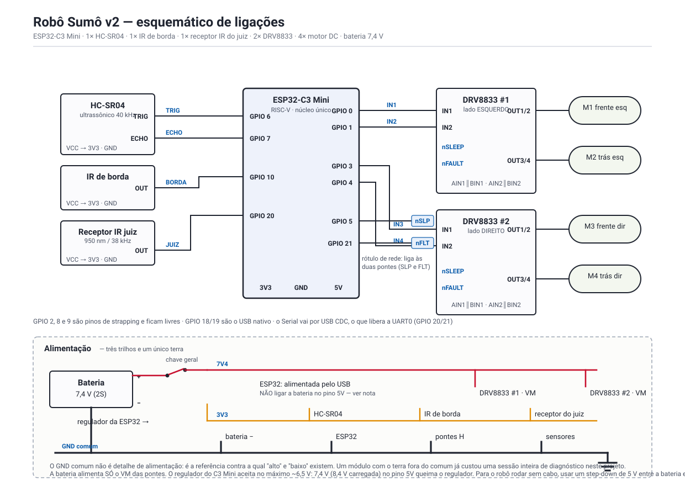

# Robô Sumô — ESP32-C3 SuperMini

Robô de sumô autônomo para a categoria Mini Sumô do *Sumô Tech Fight* (InovaWeek,
Universidade Vila Velha). Procura o oponente com um ultrassônico, avança e empurra;
o sensor IR vigia a borda da arena e traz o robô de volta antes que ele saia.



## Material

| Qtd | Componente |
|---|---|
| 1 | ESP32-C3 SuperMini |
| 1 | Ponte H TB6612FNG (canal A + canal B) |
| 2 | Motor DC (2 rodas) |
| 1 | HC-SR04 — ultrassônico, acha o oponente |
| 1 | Módulo IR — **saída analógica (AO)**, vigia a borda |
| 1 | Bateria 7,8 V |
| 1 | Step-down 5 V (ver *Alimentação*) |
| — | Resistores dos divisores: 1 kΩ, 2 kΩ, 2× 10 kΩ |
| — | Receptor do controle do edital — pino reservado, ainda não montado |

## Pinagem

### ESP32-C3 → componentes

| GPIO | ADC | Sinal | Vai para |
|---|---|---|---|
| **0** | **ADC1_CH0** | `AO` | IR de borda — **via divisor 10 k / 10 k** |
| **3** | — | `AIN1` | TB6612FNG pino 21 — canal A (roda esquerda) |
| **4** | — | `AIN2` | TB6612FNG pino 22 — canal A (roda esquerda) |
| **5** | — | `BIN1` | TB6612FNG pino 17 — canal B (roda direita) |
| **6** | — | `BIN2` | TB6612FNG pino 16 — canal B (roda direita) |
| **7** | — | `STBY` | TB6612FNG pino 19 — ALTO = ativo |
| **10** | — | `TRIG` | HC-SR04 — 3,3 V direto, sem divisor |
| **20** | — | `ECHO` | HC-SR04 — **via divisor 1 k / 2 k** |
| **21** | — | reservado | receptor do controle do edital (sem leitura ainda) |
| 1 | ADC1_CH1 | — | livre |

**Livres e intocáveis:** 2, 8 e 9 são pinos de strapping — o nível deles no reset
decide de onde a placa dá boot, e carregar um deles faz a placa não subir com um
sintoma que não parece elétrico, parece firmware quebrado. 18 e 19 são o USB nativo.

### TB6612FNG — pinagem completa

| Pino | Nome | Liga em |
|---|---|---|
| 24, 13, 14 | `VM1`, `VM2`, `VM3` | **bateria 7,8 V** |
| 20 | `VCC` | **3,3 V da ESP32** — ver o aviso abaixo |
| 18 | `GND` | GND comum |
| 3, 4, 9, 10 | `PGND1`, `PGND2` | GND comum |
| 21 | `AIN1` | GPIO 3 |
| 22 | `AIN2` | GPIO 4 |
| 23 | `PWMA` | **jumper para 3V3** |
| 17 | `BIN1` | GPIO 5 |
| 16 | `BIN2` | GPIO 6 |
| 15 | `PWMB` | **jumper para 3V3** |
| 19 | `STBY` | GPIO 7 |
| 1, 2 / 5, 6 | `AO1` / `AO2` | motor esquerdo |
| 11, 12 / 7, 8 | `BO1` / `BO2` | motor direito |

> **`VCC` da ponte vai em 3,3 V, não em 5 V.** A datasheet dá
> `VIH = VCC × 0,7` para as entradas lógicas. Com `VCC` em 5 V isso exige
> **3,5 V** para reconhecer um nível ALTO — e a C3 entrega no máximo 3,3 V, ou
> seja, nunca chegaria lá com folga. Com `VCC` em 3,3 V o limiar cai para 2,31 V
> e sobra margem. O `VM` dos motores continua nos 7,8 V da bateria: são
> alimentações independentes, e é para isso que a ponte tem duas.

> **`PWMA` e `PWMB` vão jumpeados em 3V3.** Os 7 pinos da ponte não cabem: são
> 10 GPIOs úteis no C3 e a conta pedia 11 (7 + TRIG + ECHO + IR + receptor). Com
> os `PWM` fixos em ALTO, o PWM é aplicado nos próprios `AIN`/`BIN` — pela
> tabela-verdade da datasheet isso alterna entre **CW** e **short brake**, que é
> decaimento lento e dá mais torque parado do que o decaimento rápido. Num sumô
> o que decide a partida é o empurrão parado, não a velocidade de ponta.

## Divisores de tensão

A ESP32-C3 é 3,3 V e **não tolera 5 V nos GPIO**. Os dois sensores operam em 5 V,
então cada um tem o seu divisor. Em ambos, `R1` é o resistor em série com o sinal
e `R2` vai do nó para o GND; o GPIO se conecta ao nó.

```
 Vout = Vin × R2 / (R1 + R2)
```

### 1. `ECHO` do HC-SR04 → GPIO 20

```
   ECHO (5 V) ──[ R1 = 1 kΩ ]──┬── GPIO 20
                               │
                          [ R2 = 2 kΩ ]
                               │
                              GND
```

`Vout = 5 V × 2k / (1k + 2k) = 3,33 V` — abaixo dos 3,6 V de máximo absoluto do GPIO.

### 2. `AO` do IR → GPIO 0 (ADC1)

```
   AO (5 V) ──[ R1 = 10 kΩ ]──┬── GPIO 0  (ADC1_CH0)
                              │
                         [ R2 = 10 kΩ ]
                              │
                             GND
```

`Vout = 5 V × 10k / (10k + 10k) = 2,50 V`

**Por que não 1 k / 2 k aqui também:** o `ECHO` é digital e só precisa caber
abaixo de 3,6 V. Este é analógico, e o ADC da C3 satura perto de 3,1 V — parar
em 2,5 V mantém a escala inteira dentro da faixa linear, em vez de achatar o
extremo contra o teto do conversor.

**O divisor divide também o limiar.** `IR_LIMIAR_MV` é a tensão medida **no
GPIO**, já dividida — não a que sai do sensor. Com razão de 0,5, um limiar de
1600 mV no código corresponde a 3,2 V na saída do módulo.

`TRIG` não precisa de divisor: é entrada do HC-SR04, e os 3,3 V da C3 bastam
para dispará-lo.

## Alimentação

| Trilho | Origem | Alimenta |
|---|---|---|
| **7,8 V** | bateria, direto | `VM1/VM2/VM3` da TB6612FNG |
| **5 V** | step-down a partir da bateria | pino `5V` da ESP32, `VCC` do HC-SR04, `VCC` do IR |
| **3,3 V** | regulador da própria ESP32 | `VCC` da TB6612FNG (pino 20) |
| **GND** | — | um único ponto comum: bateria, ponte, sensores e ESP |

> **Observação de montagem — o step-down não é opcional.** A bateria **não pode**
> ir direto na ESP32: o regulador do C3 SuperMini (ME6211) aceita cerca de 6,5 V
> no máximo, e 7,8 V queima o componente. É preciso um step-down de 5 V entre a
> bateria e o pino `5V` da placa. Na bancada dá para pular isso alimentando a
> ESP32 pelo cabo USB, com a bateria ligada só no `VM` da ponte.

> **O GND comum não é detalhe de alimentação** — é a referência contra a qual
> "alto" e "baixo" existem. Um módulo com o terra fora do comum já custou uma
> sessão inteira de diagnóstico neste projeto.

O `VM` em 7,8 V é proposital: a TB6612FNG aceita até 15 V, e é essa tensão que dá
agilidade no avanço máximo.

## Ajuste do comportamento

Os três números que mais mudam ficam no **topo do [`config.h`](config.h)**:

| Constante | Padrão | O que faz |
|---|---|---|
| `IR_LIMIAR_MV` | `1600` | mV no GPIO que separam o piso preto da faixa branca |
| `IR_BORDA_ABAIXO` | `1` | 1 = a faixa branca é a leitura **mais baixa** |
| `US_ALCANCE_CM` | `60` | até onde um eco conta como oponente |

**Como calibrar o IR:** com o monitor serial aberto, `p` mede o piso preto e `b`
mede a faixa branca (600 ms cada, e ele avisa se a leitura estiver instável).
Ponha `IR_LIMIAR_MV` no meio das duas medidas e regrave.

## Lógica

A ordem de prioridade é o desenho do firmware, não uma sequência de `if`:

1. **Borda** — o IR é a trava de segurança. Uma task de prioridade 6 varre o ADC
   a 1 kHz e, ao ver a faixa clara, preempta o ataque no meio: freio, recuo e
   giro para dentro. O sentido do giro alterna a cada salvamento, para o robô não
   colher a mesma borda quando está preso entre duas.
2. **Alvo** — enquanto o HC-SR04 vê alguém à frente e o IR não vê borda, avança
   em cima e empurra. Abaixo de 18 cm vai com tudo.
3. **Busca** — sem alvo e sem borda, gira varrendo.

Modos de combate: `NORMAL`, `LESMA`, `CAPIROTO`, `CACADOR`, `MURALHA`, `DANCINHA`
— multiplicam a afinação base e trocam pelo painel ou pela tecla `m`.

## Compilar e gravar

Toolchain: **PlatformIO**, board `esp32-c3-devkitm-1`. Nenhuma biblioteca externa.

```bash
pio run                  # compila
pio run --target upload  # grava (porta autodetectada)
pio device monitor       # 115200 baud
```

O C3 SuperMini não tem chip USB-serial: o USB é nativo do MCU. É por isso que o
`platformio.ini` liga `ARDUINO_USB_CDC_ON_BOOT` — sem essa flag o Serial não
aparece, e esse silêncio costuma ser confundido com firmware travado no boot.

## Painel web

Ao ligar, o robô sobe um ponto de acesso aberto:

- Rede **`ROBO_SUMO`** (sem senha)
- `http://192.168.4.1` ou `http://robosumo.local`

Mostra distância, eco cru, leitura do IR em mV contra o limiar, PWM das rodas e o
estado da máquina de estados. Aciona: start/stop, os seis modos e a pilotagem
manual (frente, ré, girar para cada lado, parar). Não há ajuste de parâmetro na
tela — a afinação é feita no código.

A pilotagem tem corte por silêncio: se a aba fechar ou o Wi-Fi cair com o robô
andando, ele para sozinho em 700 ms.

## Serial

115200 baud, uma linha por segundo com o olho, o IR e o sistema.

| Tecla | Ação |
|---|---|
| `s` | autoteste |
| `a` | armar / parar |
| `m` | próximo modo |
| `p` | medir o piso preto |
| `b` | medir a faixa branca |
| `?` | ajuda |

Leia o autoteste antes de suspeitar da lógica — a maior parte dos problemas deste
projeto foi fiação, não software.

## Pendente

O receptor do controle do edital tem o **GPIO 21 reservado e nada mais**: a
decodificação do protocolo ainda não existe, então hoje quem arma o robô é o
painel web ou a tecla `a`. Enquanto isso não entrar, o robô não atende ao artigo
do regulamento que exige o receptor do juiz.
